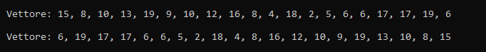

## Inversione di un vettore

Implementazione ricorsiva dell'algoritmo di inversione ricorsivo che inverte
la posizione di tutti gli elementi di un vettore.

# Componenti della ricorsione
1. **Condizioni di terminazione:** `if(j <= i)`
2. **Istruzione di terminazione:** `return`
3. **Passo di avvicinamento:** `i+1` - `j+1`
4. **Chiamata ricorsiva:** `inverti_vet(v, i+1, j-1)`

# Utilizzo
1. Crea in Code::Blocks un nuovo progetto.
2. Copia il codice sorgente.
3. Compila ed esegui.

# Codice sorgente

```cpp
#include <iostream>
#include <ctime>

void inverti_vet(int v[], int i, int j);

int main(){

    int lung_vett = 20;
    int vett[lung_vett];
    int val_min = 1;
    int val_max = 20;

    srand(time(NULL));

    std::cout << std::endl;
    std::cout << "\tVettore: ";

    for(int i = 0; i < lung_vett; i++){
        vett[i] = val_min + (rand() % (val_max - val_min + 1));
        if(i < lung_vett-1)
            std::cout << vett[i] << ", ";
        else
            std::cout << vett[i];
    }
    std::cout << std::endl;

    inverti_vet(vett, 0, lung_vett - 1);

    std::cout << std::endl;
    std::cout << "\tVettore: ";

    for(int i = 0; i < lung_vett; i++){
        if(i < lung_vett-1)
            std::cout << vett[i] << ", ";
        else
            std::cout << vett[i];
    }

    std::cout << std::endl;
    return 0;
}

void inverti_vet(int v[], int i, int j){
    if(j <= i)                      // condizione di terminazione: gli indici hanno scavallato
        return;                     // fine ricorsione
    else
        inverti_vet(v, i+1, j-1);   // chiamata ricorsiva + passi di avvicinamento

    // swap
    int temp = v[i];
    v[i] = v[j];
    v[j] = temp;
}
```

# Output



# Autore

Gabriele Henriet - [GitHub](https://github.com/Gabri-dev-C)

# Licenza

MIT License
